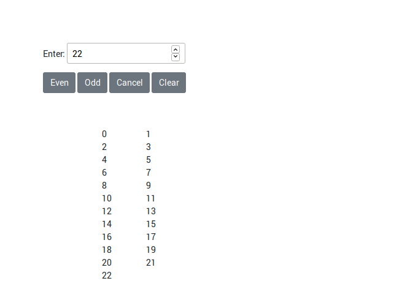

# js-oddoreven
##Iterate odd and even functions base on user input

Javascript school assignment.

    To create a function that iterates numbers either in even or odd
    until the last number from user input
    

